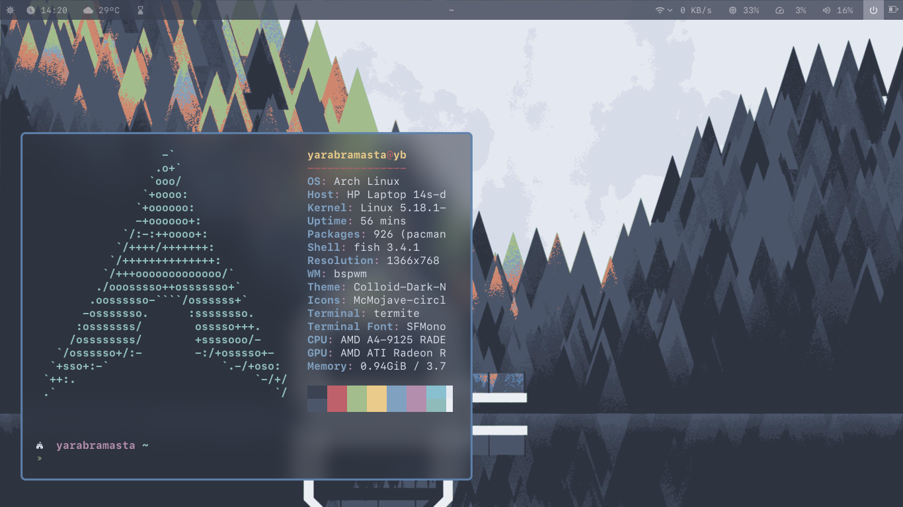
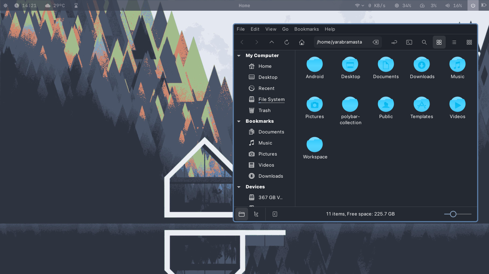
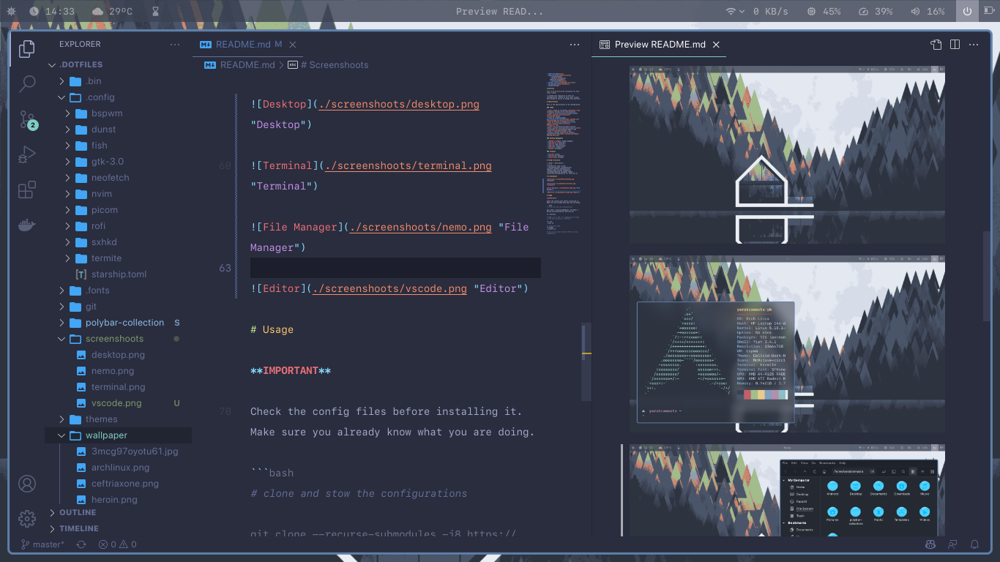

# Dotfiles

- [Dotfiles](#dotfiles)
- [Specification](#specification)
    - [Theme](#theme)
    - [Desktop Management](#desktop-management)
    - [Terminal](#terminal)
- [Folder Structure](#folder-structure)
- [Screenshoots](#screenshoots)
- [Usage](#usage)

This is my **.dotfiles** collection for Arch Linux ricing.

I created this repository to hold all configurations related to Arch Linux ricing. Stow became my choice to manage this dotfiles.

# Specification

Here is the specification of my configuration.

### Theme

- Color scheme by [nordtheme.com](https://www.nordtheme.com/docs/colors-and-palettes)
- Theme by [vinceliuice/Colloid-gtk-theme](https://github.com/vinceliuice/Colloid-gtk-theme)
- Fonts by [sahibjotsaggu/San-Francisco-Pro-Fonts](https://github.com/sahibjotsaggu/San-Francisco-Pro-Fonts)
- Icon by [vinceliuice/McMojave-circle](https://github.com/vinceliuice/McMojave-circle)
- Cursor by [vinceliuice/Layan-cursors](https://github.com/vinceliuice/Layan-cursors)
- Wallpaper by [nordthemewallpapers.com](https://nordthemewallpapers.com)
- Overall configs inspired by [webpro/awesome-dotfiles](https://github.com/webpro/awesome-dotfiles)

### Desktop Management

- **BSPWM & SXHKD** (window manager)
- **Polybar** (status bar)
- **Rofi** (app launcher)
- **Dunst** (notification)
- **Picom** (compositor)
- **Feh** (wallpaper)

### Terminal

- **Fish** (shell)
- **Termite** (emulator)
- **Starship** (prompt)

# Folder Structure

| folder | description |
|--|--|
|.bin|Utility shell files|
|.config|Stow-able configurations|
|git|Git related configurations|
|themes|Theme related submodules|
|wallpaper|Desktop wallpaper images|
|xorg-conf|Configurations for xorg.conf.d|

# Screenshoots







# Usage

**IMPORTANT**

Check the config files before installing it. Make sure you already know what you are doing.

```bash
# clone and stow the configurations

git clone --recurse-submodules -j8 https://github.com/yarabramasta/.dotfiles.git

cd .dotfiles

# WARN: all of the 'cd' command must be done at the main directory (.dotfiles)

cd .bin
./sync.sh

# installing theme
cd themes
./install.sh

# now you can apply the gtk theme by using lxappearance
```